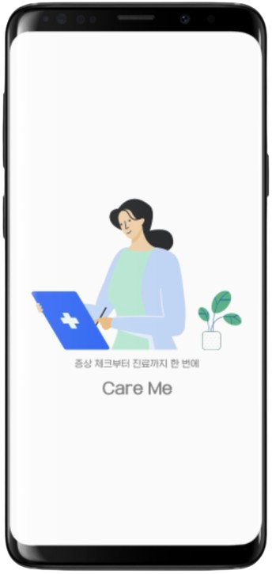
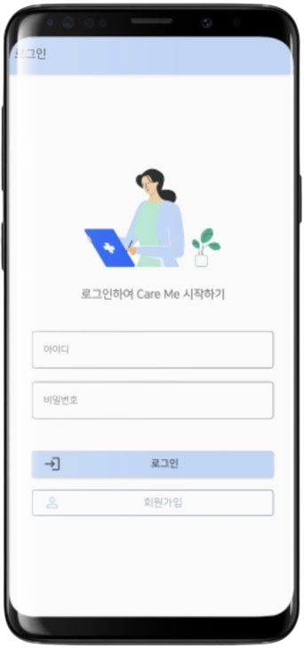
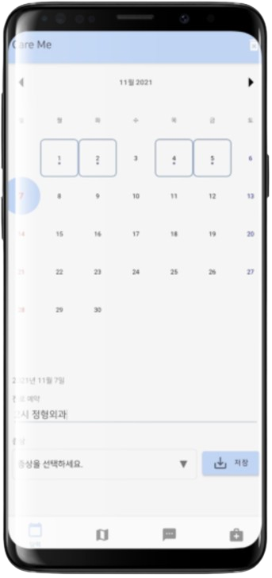
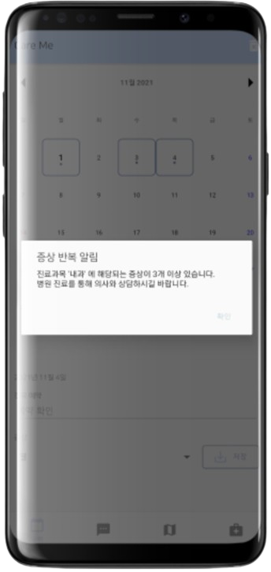
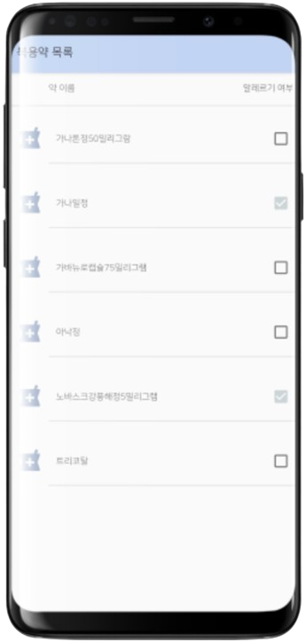
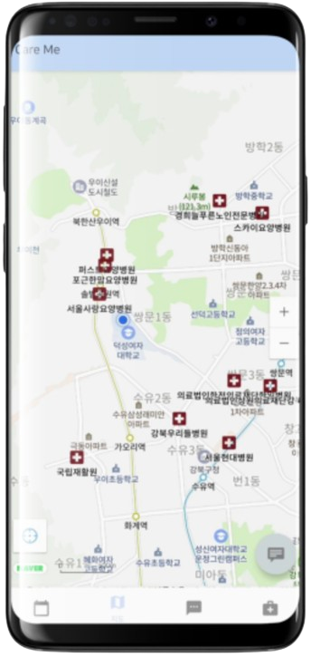
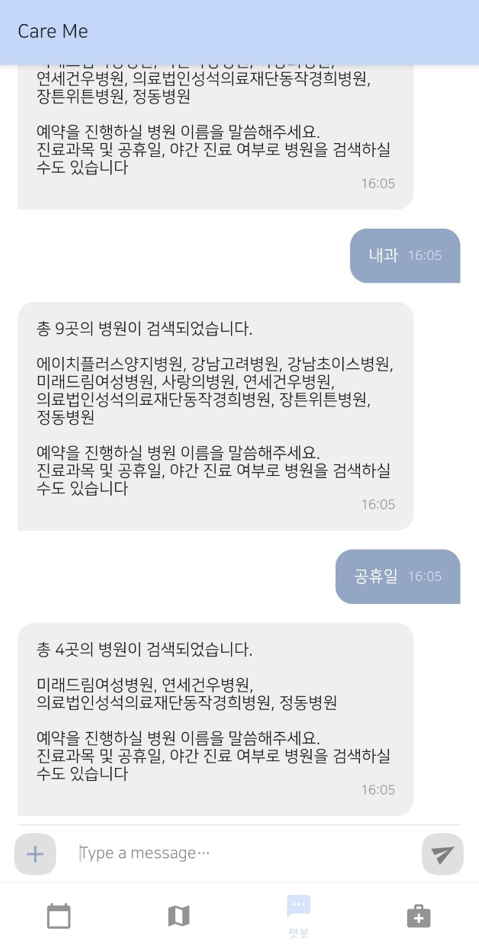
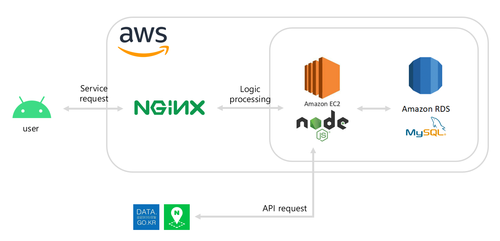
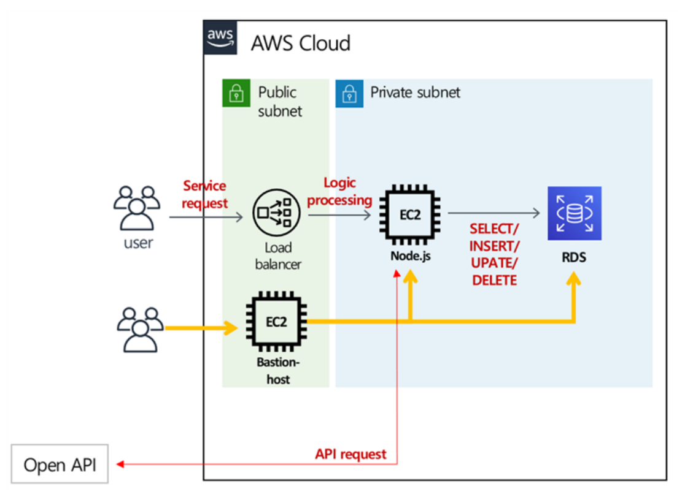

# 안드로이드 헬스케어 어플리케이션

> 캡스톤 디자인

 

### 프로젝트 개발 기간

`2021.03.` ~ `2021.11.` (9개월)

 

# 📌 기술 스택

### Language

  
  

### Database

  

### Server

  
  
  
  
  

### IDE

  
  

### VCS

    
    
    

### Tools

  
  

### Library

- [Retrofit2](https://github.com/square/retrofit)

### Open Source

- [play-services-mlkit-text-recognition](https://developers.google.com/ml-kit?hl=ko) `17.0.0`
- [prolificinteractive:material-calendarview](https://github.com/prolificinteractive/material-calendarview) `1.4.3`
- [stfalcon-studio:Chatkit](https://github.com/stfalcon-studio/ChatKit) `0.4.1`
- [airbnb.android:lottie](https://github.com/airbnb/lottie-android) `4.1.0`

### Open API

- [국립중앙의료원\_전국 병의원 찾기 서비스](https://www.data.go.kr/data/15000736/openapi.do)
- [건강보험심사평가원\_의료기관별상세정보서비스](https://www.data.go.kr/data/15001699/openapi.do)

 

# 📌 프로젝트 기능

### 🗓️ 달력

- 증상 기록
- 증상 반복 알림
- 진료 일정 확인

### 🗺️ 지도

- 가까운 병원 및 약국 조회

### 💬 챗봇

- 조건을 적용한 병원 검색
- 병원 예약

### 💊 약봉투

- OCR 기능을 통한 약봉투 인식
- 알러지 약을 기록하여 사전에 예방 

 

# 📌 프로젝트 화면

|                         스플래시                         |                         로그인                         |                         달력                         |                         알림                         |
| :------------------------------------------------------: | :----------------------------------------------------: | :--------------------------------------------------: | :--------------------------------------------------: |
|  |  |  |  |

|                        약 봉투                         |                        약 목록                         |                         지도                         |                         챗봇                         |
| :----------------------------------------------------: | :----------------------------------------------------: | :--------------------------------------------------: | :--------------------------------------------------: |
|  |  |  |  |

 

# 📌 산출물

### 시스템 아키텍처

|  |  |
| -------------------------------------------------- | --------------------------------- |

 

# 📌 팀원 소개

|                                              연주원                                              |                                                 손경린                                                 |                                            전수진                                            |
| :----------------------------------------------------------------------------------------------: | :----------------------------------------------------------------------------------------------------: | :------------------------------------------------------------------------------------------: |
|  |  |  |
|                        팀장 달력에 증상 관리 기능 약봉투 인식 기능                         |                                     가까운 병원 및 약국 찾기 기능                                      |                                    챗봇을 통한 예약 기능                                     |
